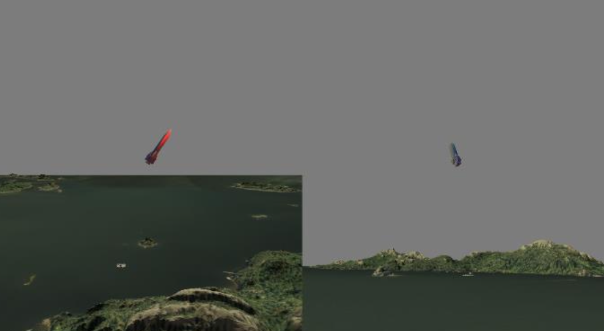

# 3D Rocket Simulation and Visualization Project
This project involves creating a dynamic 3D simulation and visualization of a rocket launch, incorporating a range of computer graphics techniques and principles. Developed using modern OpenGL, the application features real-world terrain modeling, custom 3D models, texture mapping, lighting, animations, and camera tracking to deliver an interactive exploration experience of a rocket launch.

## Features
- **Terrain Visualization**: Utilizes real-world elevation data to render the launch area with detailed terrain features.
- **Rocket and Launchpad Models**: Includes custom-designed 3D models for the rocket and launchpad, rendered with texture mapping and lighting effects.
- **Dynamic Lighting**: Implements local light sources and the Blinn-Phong shading model to simulate realistic lighting conditions.
- **Interactive Animation**: Animates the rocket launch sequence, allowing users to initiate and reset the launch with UI controls.
- **Camera Tracking**: Offers multiple camera modes to track the rocket's flight from different perspectives, enhancing the viewing experience.
- **Particle System**: Simulates rocket exhaust using a particle system for added realism.
- **Performance Measurement**: Integrates rendering performance measurement tools to optimize the simulation.

## Getting Started
- **Installation**: Download the latest release and extract the contents.
- **Running the Simulation**: Navigate to the project directory and execute the application.

## Controls
- **Camera Movement**: Use the mouse and keyboard (WSAD+EQ) for navigating the scene.
- **Launching the Rocket**: Press the designated UI button or key to start the launch sequence.
- **Camera Modes**: Switch between different camera views using the 'C' key.
- **Reset Animation**: Reset the rocket to its initial position with the 'R' key.

## Development
This project was developed by a team, following best practices in graphics programming and collaborative development. Each team member contributed to different aspects of the project, from implementing core graphics functionalities to fine-tuning the user interface and interactivity.

For more information on the development process, technical details, and the team's contributions, please refer to the project documentation.

## License
This project is licensed under the terms of the MIT license.

## Acknowledgments
Special thanks to the data providers for the terrain and elevation datasets, and to all open-source software and libraries that made this project possible.

